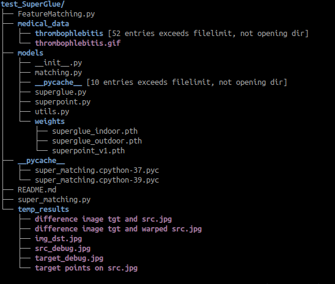

#test_SuperGlue
Get data and weights from [Link](https://drive.google.com/drive/folders/1QtQcDh7bAlyAtDDrYeJ2F5iDKjAvJXYg?usp=sharing)

And put them in file structure as follows 




Run
```
python FeatureMatching.py -ref ./medical_data/thrombophlebitis/frame_00_delay-0.1s.png -align ./medical_data/thrombophlebitis/frame_10_delay-0.1s.png
```
